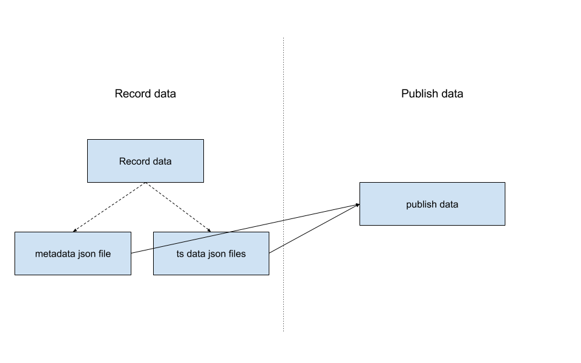

# replay-demo #

[]
(<https://travis-ci.org/VictorDu/replay-demo>)

## Flow Chart ##



## DESCRIPTION ##

This project is to replay the record time series dataset and send to a new org.

From the flow chart above, this project has two phases.

- Download data from servers and store them into the data directory.There are 2
 kinds of data files: metadata json file and time series data json files.

- Publish recorded data to new org.

## USAGE ##

Python command line tool and docker based data publish tool.

## Python commandline tool ##

- Please confirm your python path include the [signalfx/dtools](https://github.com/signalfx/dtools).
- Please install python dependencies : pip install -r requirements.txt

### Basic Usage ###

There are two basic usages for this tool: record data and publish data.

```
PYTHONPATH=../dtools ./replay-data -h

usage: replay-data [-h] {record,publish} ...

Tool for replay the time series data

positional arguments:
  {record,publish}
    record          record tool
    publish         publish tool

optional arguments:
  -h, --help        show this help message and exit
```

### Record data ###

The record data tool can record data based on the configuration file and create
a tar file named 'replay-data.tar.gz' in current directory.
Here is the usage for record tool and description for configuration file.

```
PYTHONPATH=../dtools ./replay-data record -h

usage: replay-data record [-h] -f FILE

optional arguments:
  -h, --help            show this help message and exit
  -f FILE, --file FILE  configuration file for recording data
```

If you want recording data, you just need to pass the configuration file.

#### Configuration file ####

Configuration json file for recording data.

```json
{
  "api_server" : "https://mon-api.signalfx.com",
  "record_token" : "xxxxxxxxxxxxxxxxxxxxxx",
  "query" : ["sf_metric:ui.signalboost.get.time AND sf_isActive:true",
             "sf_metric:ui.stream.activestreams AND sf_isActive:true"],

  "start_time" : "11.29.2015 08:00:00",
  "time_range": "hour",
  "data_file_interval" : 0.05,

  "data_directory" : "hour-data"
}
```

- "api_server" : API server of signalfx.
- "record_token" : Access token for api server
- "query" : Query sentence array of metadata.

- "ts_server" : Time seires data server.
- "start_time" : Start time of recorded time series data [MM.DD.YYYY HH:MM:SS]
- "time_range" : The duration you want to record the metrics for. To make
 metrics line up when replayed the possible values are 'week' 'day' or 'hour'.
- "data_file_interval" : Hour interval for each data file.

- "data_directory" : Directory to store recorded data.

#### Record data example usage ####

```
PYTHONPATH=../dtools ./replay-data record -f configuration-hour.json
```

### Publish data ###

The publish data tool can replay the time series data by recorded data and
 configuration parameters. Here is the usage and description for every
 parameters.

```
PYTHONPATH=../dtools ./replay-data publish -h

usage: replay-data publish [-h] -d DIR -t TOKEN -i INGEST [-f FILE] [-v]

optional arguments:
  -h, --help            show this help message and exit
  -d DIR, --dir DIR     recorded data directory
  -t TOKEN, --token TOKEN     api_token for publishing data
  -i INGEST, --ingest INGEST     ingest url for publishing data
  -f FILE, --file FILE  log file path
  -v, --verbose         verbose log file
```

#### Publish data example usage ####

```
PYTHONPATH=../dtools ./replay-data publish -d hour-data \
-t xxxxxxxxxxxxxxxxxxxxxx -i http://lab-ingest.corp.signalfuse.com:8080 \
-f /tmp/test.log -v
```

## Docker based data publish tool ##

### Description ###

This image can publish recorded data from 'replay-data.tar.gz' in a complete
 containerized environment.

### Usage ###

```
docker run -e api_token=API_TOKEN -e ingest_endpoint=INGEST_HOST \
-e log_file=LOG_FILE_PATH -e verbose=true docker image name
```

If you want use the docker publish tool, you should put the environment
variables to docker instance. Here is the description for each environment
variable.

#### Required parameters ####

- "ingest_endpoint" : The ingest url of signalfx for publishing data.
- "api_token" : API token of signalfx for publish data.

#### Optional parameters ####

- "log_file" : Log file path.
- "verbose" : Flag for verbose log file.(true or false)

### Example Usage ###

```
docker build -t replaydemo .
docker run -it -e api_token=xxxxxxxxxxxxxxxxxxxxxx \
-e ingest_endpoint=http://lab-ingest.corp.signalfuse.com:8080 \
-e log_file=/var/publish_data.log -e verbose=true replaydemo
```
